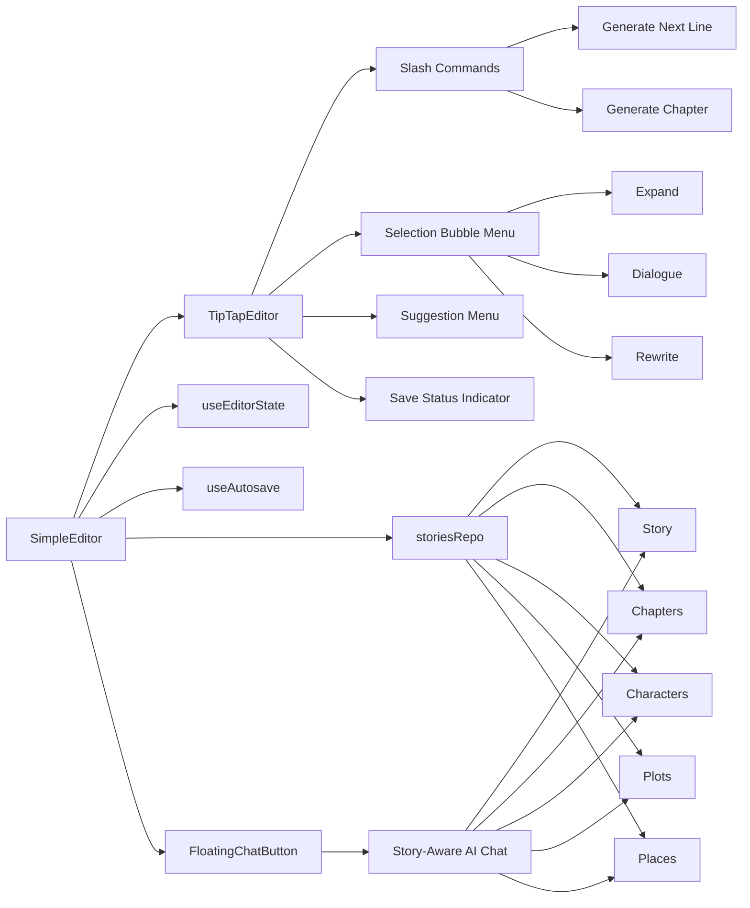
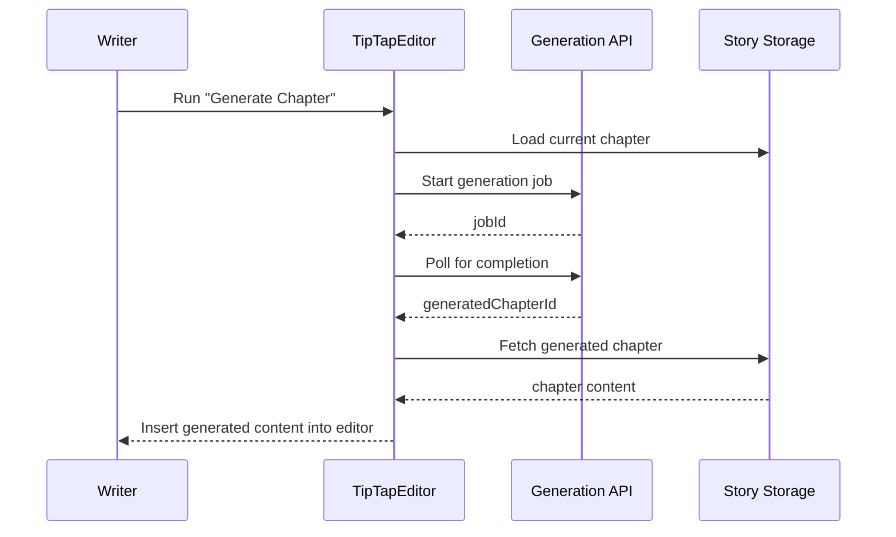
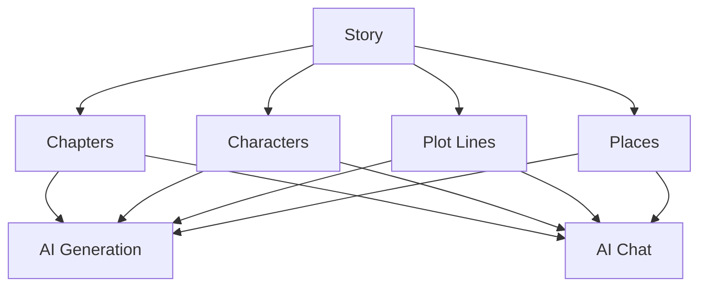

# The Editor: Building the Writing Tool I Actually Wanted to Use

At some point, I realized most writing tools fall into one of two categories.

They either give you a blank page and politely disappear, or they throw AI into the product like glitter on a school project and call it innovation.

I wanted neither.

I wanted an editor that actually felt like it understood writing. Not just text. Not just formatting. Not just "type here and good luck." I wanted something that could help an author draft, revise, organize chapters, track characters, remember worldbuilding, and collaborate with AI without making the whole experience feel like wrestling with a confused robot.

So I built it and I named it `SimpleEditor` but it's not lol.

The editor in is one of the core pieces of `TheTaleTribe`. On the surface, it is where authors write chapters. Underneath, it is trying to do something more ambitious: combine a writing-first experience, structured story data, and context-aware AI into one workspace. I also wanted to keep this as minimal as possible. I took some inspiration from google docs and apple pages. I still need the paginated pages working and that's definately coming in a future release.

Basically, I wanted the editor to feel less like Google Docs wearing a fantasy disguise, and more like a creative control room for building stories.

## What the Editor Actually Does

At a high level, the editor is designed to support the full writing loop and I tried to keep this as simple as possible.

- Draft
- Organize
- Revise
- Brainstorm
- Save
- Publish

Instead of treating writing as one giant blob of text, the editor works together with the rest of the story system. Chapters, characters, places, plots, and AI context all connect back to the writing experience.

So the editor is not just a page. It is more like the front door to the whole story engine.

### Current Feature Set

- Slash commands for fast in-editor actions
- AI next-line suggestions with multiple selectable options
- AI chapter generation
- Highlight-based AI actions like expand, dialogue, and rewrite
- Autosave with save-state feedback
- Chapter creation, switching, and deletion
- Draft and publish workflows
- Rich formatting controls
- Live document insights
- Floating AI assistant with story-aware context
- Structured story schema for narrative elements like characters, plots, and places

That sounds neat in a bullet list, but the real value is how these parts work together.

## High-Level Architecture

This is the mental model behind the editor:



The important thing here is that the editor is not isolated. It sits on top of story data and passes that context into AI workflows instead of treating the manuscript as the only source of truth.

## Editor State: The brain

One of the less flashy but more important parts of the editor is the state model.

Instead of pushing everything into one giant component with a pile of unrelated `useState` calls, I split the editor's core document and workflow state into a dedicated hook: `useEditorState`. (This was how I had if before ngl)

That hook is built on `useReducer`, which made sense here because the editor is not managing one value. It is managing a coordinated system:

- the current story
- the chapter list
- the selected chapter
- story title and description
- chapter title
- loading state
- metadata dirty state
- sidebar visibility
- active tabs

That is exactly the kind of situation where reducer-based state starts to make more sense than a growing mess of ad hoc setters.

### The State Shape

At a high level, the editor state looks like this:

```ts
export interface EditorState {
  story: Story | null;
  chapters: Chapter[];
  currentChapter: Chapter | null;
  storyTitle: string;
  storyDescription: string;
  chapterTitle: string;
  isLoading: boolean;
  metadataChanged: boolean;
  activeTab: "chapters" | "ai";
  leftSidebarOpen: boolean;
  rightSidebarOpen: boolean;
  rightTab: "format" | "document";
}
```

That gives the editor one coherent source of truth for the writing workspace.

### Why I Chose `useReducer`

The big advantage of `useReducer` here is not just organization. It is coordination.

When you load a story, switch chapters, add a new chapter, update metadata, or delete a chapter, multiple pieces of state need to stay in sync. Reducer actions make those transitions explicit.

For example, loading a story updates:

- the story record
- the chapter list
- the current chapter
- the visible chapter title
- the loading state
- the metadata dirty flag

That is much easier to reason about as one state transition than as six separate setter calls spread across the component.

### The Action Pattern

The hook uses explicit actions for editor events such as:

- `LOAD_STORY`
- `SELECT_CHAPTER`
- `UPDATE_STORY_TITLE`
- `UPDATE_CHAPTER_TITLE`
- `UPDATE_CHAPTER_CONTENT`
- `ADD_CHAPTER`
- `DELETE_CHAPTER`
- `TOGGLE_LEFT_SIDEBAR`
- `TOGGLE_RIGHT_SIDEBAR`
- `SET_RIGHT_TAB`

This gives the editor a predictable event model. The UI can stay relatively simple because the state logic is centralized instead of leaking across the whole tree.

### Why This Matters for a Writing Tool

Writing tools get complicated fast.

The moment you mix document editing, chapter navigation, autosave, publishing, formatting controls, and AI actions, state can become the thing that quietly ruins the product if it is not handled well.

Using a reducer-backed editor state hook does a few useful things:

- it keeps related transitions grouped together
- it reduces accidental state drift between chapter data and visible UI state
- it makes future features easier to add without turning the editor into a fragile knot
- it separates content workflow state from TipTap's own internal editor state

That last part matters a lot. TipTap already manages the rich text document state. I did not want to fight that. So the app-level state focuses on story workflow and editor chrome, while TipTap focuses on the text editing model itself.

That separation has been one of the more useful architectural decisions in the editor.

## Was I Actually Building This Efficiently?

Mostly, yes. But I 100% agree it's not super optimized yet. I just wanted to build the MVP first and get some users first. But I'll iterate and keep improving this as time passes.

Not in the "look how academically optimal this is" sense. More in the practical product-engineering sense: the editor makes several decisions that keep the system responsive, avoid unnecessary work, and preserve room to grow without turning the whole thing into a giant architecture science fair.

That matters to me, because creative tools can get slow and fragile very quickly if every feature is layered on without discipline.

### A Few Places the Editor Is Already Efficient

- It uses a consolidated editor state hook instead of scattering related state across multiple disconnected components.
- It debounces save operations so the app is not writing to storage on every keystroke.
- It only updates story metadata when metadata actually changed.
- It tracks dirty state explicitly, which prevents unnecessary saves and makes chapter switching safer.
- It saves before risky transitions like publishing or creating a new chapter.
- It stores relationships by IDs for plot events, characters, and locations instead of duplicating large embedded objects everywhere.
- It separates story structure into reusable entities, which makes context retrieval cleaner for AI features.
- It tracks context snapshots and context usage, which is a good foundation for grounded AI responses instead of blind prompt stuffing.

A lot of the efficiency comes from data modeling, not just rendering tricks.

## AI Next-Line Suggestions: More Collaborator, Less Autocomplete

One thing I never liked about a lot of AI writing tools is that they often assume there is one obvious next sentence.

There usually is not.

Tone, pacing, character voice, mood, and scene direction all matter. So instead of forcing a single generated continuation into the editor, the `Generate Next Line` command gives multiple suggestions.

The backend uses the current chapter content, story ID, active chapter, and cursor position to generate options, and then the author gets to choose which one fits best.

That small design choice changes the feel of the feature a lot.

It stops being "the AI wrote this for you" and becomes "here are a few directions you could go." That feels much closer to how actual brainstorming works. Sometimes you do not want the machine to decide. You want it to pitch ideas and stay in its lane.

A respectful AI, basically.

## AI Chapter Generation: For When You Need a Bigger Push

Sometimes a writer only needs help with the next beat. Sometimes they need help crossing the desert.

That is where `Generate Chapter` comes in.

This feature uses the current story and chapter context to queue a generation job, wait for the result, fetch the generated content, and load it back into the editor. So instead of getting one sentence, the writer can get a rough chapter draft to react to, edit, reject, reshape, or steal one good paragraph from and pretend the rest never happened.

That gives the editor two different levels of AI support:

- micro help for the next sentence or moment
- macro help for larger drafting jumps

I like this because writing blocks are not all the same. Sometimes you are stuck on wording. Sometimes you are stuck on the entire existence of the chapter.

The editor tries to help with both.

### The Generation Flow



## Highlight, Click, Revise

Another feature I really wanted was inline AI revision.

When the writer highlights text, a bubble menu appears with AI actions:

- Expand
- Dialogue
- Rewrite

Each one sends the selected text plus the relevant story and chapter context to the backend, and the result replaces the highlighted passage directly in the editor.

That creates a much tighter revision loop:

1. Highlight the weak paragraph
2. Choose the kind of change you want
3. Get a revision
4. Keep moving

That sounds simple, but it changes the writing experience a lot. Instead of copying text into some external chatbot window and manually pasting the result back in, the author stays inside the manuscript.

That was a huge design goal for me.

If AI is going to be useful for writers, it should live where the writing happens.

That one interaction says a lot about the product philosophy. AI should be inside the act of writing, not off to the side.

## Autosave: Because Losing Words Is a Villain Origin Story

If you have ever lost a paragraph, you know the emotional stages:

- confusion
- denial
- rage
- bargaining
- staring at the ceiling

So autosave was non-negotiable.

The editor uses a debounced save flow that tracks dirty state, saves changes in the background, and provides feedback on whether content is saved, saving, pending, or blocked. It also supports manual save, queued saves, and protections around actions like publishing or switching chapters.

### Autosave Includes

- Debounced autosave
- Manual save button
- Dirty-state tracking
- Queued saves when another save is in progress
- Offline awareness
- Save-state feedback
- Explicit save before publish
- Unsaved-change protection before chapter switching or creation

This is one of those features users only notice when it fails. My goal was to make it boring in the best possible way.

Writing should feel dramatic. Saving should not.

## Draft Mode and Publish Mode

I also wanted the same workspace to support both private drafting and public release.

The editor uses the story's `isPublished` state to manage this. In practice, that means there are two modes:

- Draft mode for experimentation, revision, and chaos
- Publish mode for when the story is actually reader-facing

The publish button toggles between `Publish` and `Unpublish`, and the system saves before publishing so the author is less likely to accidentally release an older version.

That may sound obvious, but I wanted publishing to feel like part of the writing workflow, not something disconnected from it.

Because for indie authors especially, drafting and publishing are often part of the same rhythm.

## Rich Formatting Without Turning the Editor Into a Circus

I wanted the editor to support real formatting controls without overwhelming the writing experience.

The sidebar includes tools for:

- Font family and font size
- Bold, italic, underline, strikethrough
- Links
- Headings
- Bullet and ordered lists
- Blockquotes
- Dividers
- Text color and highlight color
- Alignment
- Indent and outdent
- Line height
- Paragraph spacing
- Clear formatting
- Undo and redo
- Reset document style

This is not about making the prose prettier for its own sake. It is about helping writers structure scenes, outline sections, create readable drafts, and prepare content for publication.

Also, I know writers. Give us one formatting option and we act disciplined. Give us twenty and suddenly Chapter One looks like a treaty, a diary entry, and a cult manifesto at the same time.

So the challenge was offering power without making the editor feel chaotic.

### Plot Event

```ts
export interface PlotEvent {
  id: string;
  name: string;
  content: string;
  characterIds: string[];
  locationId: string | null;
  dependencies: EventDependency[];
  dependents: EventDependency[];
  tensionLevel: number;
  pacing: "slow" | "moderate" | "fast";
  storyBeat:
    | "exposition"
    | "inciting_incident"
    | "rising_action"
    | "midpoint"
    | "climax"
    | "falling_action"
    | "resolution";
  emotionalTone?: string;
  timeConstraint?: TimeConstraint;
  orderIndex: number;
  notes?: string;
}
```

This is one of my favorite parts.

Plot lines contain structured events, and each event can hold information like:

- event name
- event content
- character IDs
- location ID
- dependencies
- tension level
- pacing
- story beat
- emotional tone
- time constraints
- order index
- notes

This turns the plot into something closer to a narrative map than a loose outline. Characters, locations, pacing, and cause-effect relationships all become connected data.

And once that structure exists, the AI gets a much better foundation to work from.

## How Context Flows Into the AI

The floating AI assistant (Imma name this bad boy Frank) is not just improvising from a prompt. So if the user really wants to harness Frank's powers he needs to add stuff to the different parts so that Frank has an idea of where the story's going.

### Context Diagram



That means responses can be based on:

- the manuscript
- the character roster
- the worldbuilding data
- the plot structure
- event relationships across the story

## What I Was Really Trying to Build

If I am being honest, this editor is also a reflection of how I like building software.

I love products that combine structure with creativity. I like when a system looks simple on the surface but has real depth underneath. I like building things that are practical, maybe slightly overengineered, but ambitious enough to grow into something bigger. The junior DEV in me also just wanted to push as many features as I wanted because I can do whatever I want.

## Future Improvements

There is still a lot I want to improve.

Some of the next steps are about polish, but a lot of them are about making the editor more context-aware, more resilient, and more useful for long-form storytelling.

### Areas I Want to Push Further

- Smarter context selection for AI so responses pull the most relevant chapters, plot events, characters, and places instead of always relying on broad full-context behavior
- Better chapter navigation and project-level organization for larger books with many chapters, arcs, and revisions
- Richer plot-to-manuscript linking so scenes in the editor can connect more directly to plot events, characters, and locations
- Inline comments or revision history for comparing drafts and AI-assisted changes over time
- More powerful slash commands for inserting templates, scene structures, and narrative beats
- Background syncing and stronger offline recovery so the editor feels safer during unstable connections
- More advanced publishing workflows, including scheduled releases or chapter-by-chapter publishing
- Better AI explainability, so writers can see what context was used and why a specific suggestion was generated

### What I Would Optimize Next

If I were focusing purely on engineering improvements, I would probably prioritize:

- reducing redundant data fetches around editor initialization and AI actions
- making context retrieval more selective instead of broad by default
- expanding caching for story entities that do not change often
- tightening the bridge between the structured story schema and the exact manuscript location the writer is working in

The main goal is not to make the system feel more "technical." It is to make it feel more invisible.

The best writing tools do a lot of work without forcing the writer to think about that work. That is the direction I want this editor to keep moving in.
